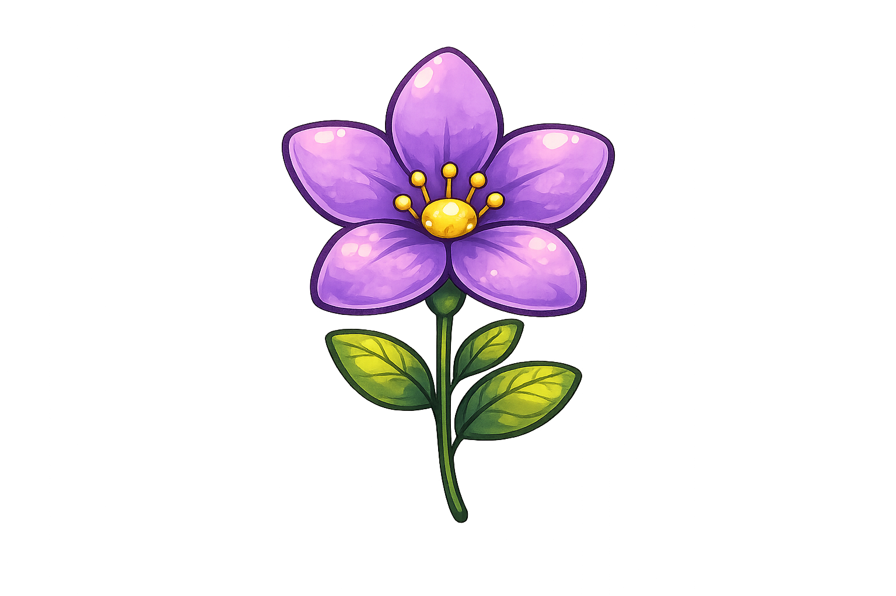
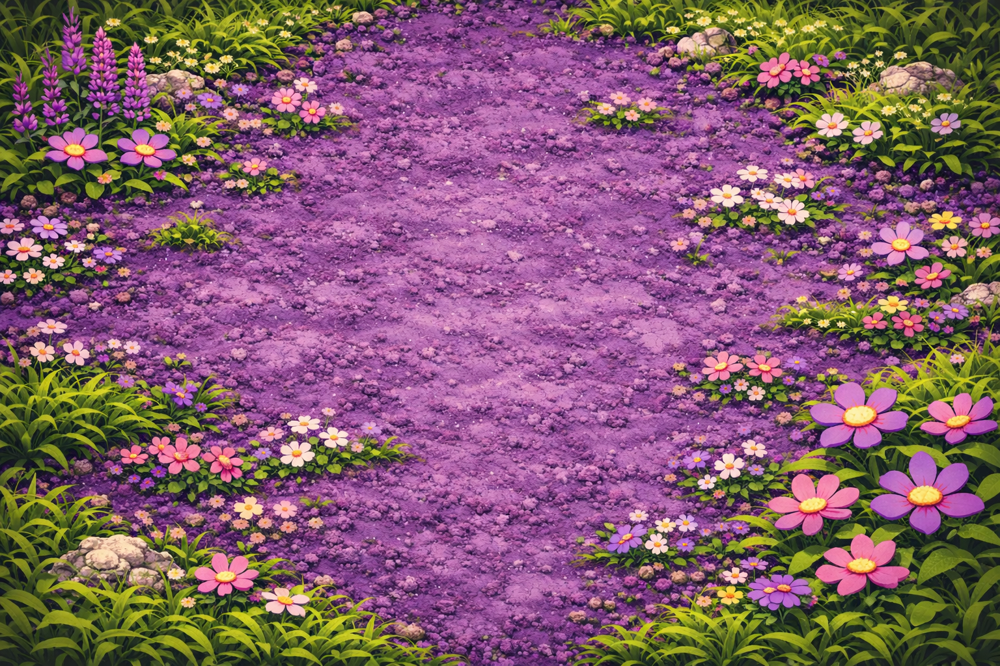
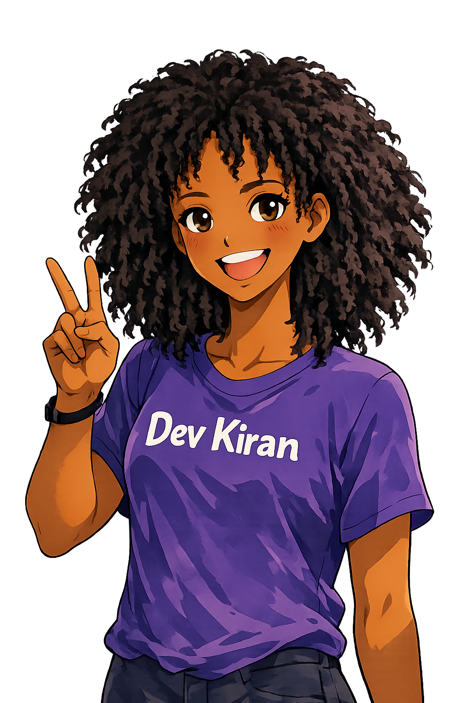

# Component Garden: The Living UI Sanctuary

<p align="center">
  
</p>

> **"Where code breathes and interfaces bloom."**

The **Component Garden** is a premium, standalone design ecosystem where high-fidelity interface elements are nurtured from pure code into flourishing digital experiences. Crafted by **Shakiran**, this sanctuary focuses on the evolution of creative UI, moving beyond static blocks to living, breathing organisms.

---

## The Vision

Traditional UI libraries are predictable. The Garden is alive. Every component here is a seed planted in a virtual soil, growing its own personality through motion, glassmorphism, and responsive soul.

<p align="center">
  
</p>

- **High-Density Bloom**: Optimized for single-viewport brilliance. 
- **Bioluminescent Particles**: Floating background symbols react to your presence.
- **Atmospheric Aesthetic**: A deep violet and solar-gold theme designed for the modern nocturnal designer.

---

## Specimen  Highlights

### The Entry Portal
A cinematic gateway featuring a high-fidelity video sanctuary and artistic typography.
*(See `public/kiran/hero.mp4` for the motion experience)*

### The Evolution Bed
A virtual landscape where components exist as interactive flora.
- **Zoom Scroll Hero**: Immersive depth-perspective scaling.
- **Pill Navbar**: Fluid transformation between navigation states.
- **Glass Auth**: Tiered transparency and crystalline blur effects.

---

## Project DNA (Tech Stack)

| Component | Technology |
| :--- | :--- |
| **Roots** | Next.js 14 (App Router) |
| **Structure** | Material UI (MUI) |
| **Kinetics** | Framer Motion |
| **Neural Path** | Zustand (State Management) |
| **Skin** | Tailwind CSS v4 |

---

## Evolutionary Logs

### `Latest Phase: Branding & High-Density Polish`
- **Custom Iconography**: Unified `logo.png` across all platform touchpoints.
- **Mobile Optimization**: Character-first layering with balanced top-spacing (64px).
- **Premium UI**: Solid-gold high-contrast Intro button for better accessibility and style.
- **Symbol Density**: Responsive particle counts (30 on mobile / 80 on desktop).

### `Full Extraction Phase`
- Decoupled from "The-Arcade" ecosystem for standalone performance.
- Refactored component store for zero-dependency portability.

---

## Deployment

### Soil Preparation
```bash
npm install
```

### Watering the Seeds
```bash
npm run dev
```

Visit [http://localhost:3000](http://localhost:3000) to see the garden in full bloom.

---

<p align="center">
  
  <br />
  <b>Created with passion by Shakiran.</b><br />
  <i>UI Gardener • Code Curator</i>
</p>
